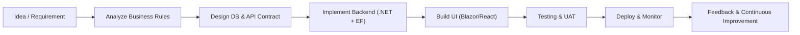

<!--
  Developer Profile for LY DAI CUONG
  Use this content for GitHub profile README or portfolio.
-->

  

  <h3 style="font-size:1.4rem; font-weight:600; color:#F97316; margin-top: 0px;">
    Fresher .NET Developer · Full‑stack Enthusiast
  </h3>

  

    
    
    
  

  

    Motivated <strong>Fresher .NET Developer</strong> with a strong eagerness to learn,
    build real‑world products and collaborate in professional teams. I love working with
    <strong>ASP.NET Core, Entity Framework, Blazor, React, SQL</strong> and turning
    business requirements into clean, maintainable code.
  

  

---

## 🌈 Overview

- **Name**: LY DAI CUONG
- **Role**: Fresher .NET Developer
- **Location**: Ho Chi Minh City, Viet Nam
- **Interests**: Enterprise systems, clean architecture, data‑driven dashboards, AI‑assisted coding

> “Write code that your future self (and your teammates) will thank you for.”

---

## 🔥 Tech Stack Radar

<table>
  <tr>
    <th>Backend</th>
    <th>Frontend</th>
    <th>Database & Cloud</th>
    <th>Tools & Others</th>
  </tr>
  <tr>
    <td>
       
      ASP.NET Core · ABP Framework · MVC · Web API
    </td>
    <td>
       
      React · TypeScript · Tailwind CSS · Ext.NET
    </td>
    <td>
       
      MS SQL Server · PostgreSQL · MongoDB · MySQL
    </td>
    <td>
       
      Git · GitHub · DevExpress · Cloudinary
    </td>
  </tr>
</table>

---

## ⚙️ Development Workflow

---

## 🧭 Experience Timeline

### HQSOFT Company Limited · .NET Developer

`March 2025 – November 2025`

**Ajinomoto VNTT – eSales DMS Solution**

- **Description**: Enterprise DMS project on HQSOFT's Xspire Business Platform using the **eSales DMS Solution** to help Ajinomoto optimize distribution, improve sales efficiency, and monitor business performance.
- **Tech**: ABP Framework, ASP.NET Core, C#, Entity Framework, Blazor, DevExpress, PostgreSQL
- **Tools**: ABP Suite, Cursor AI Agents
- **Contributions**:
  - Built master data screens (products, customers, KPIs, etc.)
  - Participated in solution design & UI/UX discussions
  - Applied AI agents (Cursor) to speed up and standardize development
  - Supported UAT, release and system stabilization
  - Improved backend skills with ABP Framework and UI skills with Blazor + DevExpress

---

**Sabeco AMS**

- **Description**: Enterprise software project for distribution management and sales force automation, focusing on business process optimization.
- **Tech**: ASP.NET MVC (Razor + Ext.NET), HQ eSkyFramework, C#, JavaScript, SQL Server
- **Contributions**:
  - Implemented several master data management screens using ASP.NET MVC & Ext.NET
  - Learned domain knowledge about DMS‑SFA processes
  - Strengthened SQL skills: data manipulation, querying and debugging on SQL Server & PostgreSQL

---

## 🎓 Education

**Ton Duc Thang University** (2021 – 2025)

- Bachelor of Software Engineering
- **GPA**: 8.14 / 10
- Focus: Software engineering principles, web development, databases, OOP

---

## 📊 GitHub Stats & Visualizations

 

---

## 📌 What I’m Focusing On

- **Short‑term**:
  - Strengthening **ASP.NET Core + EF Core + SQL Server/PostgreSQL**
  - Building cleaner architectures with **ABP Framework**
  - Practicing **React + TypeScript + Tailwind CSS** for modern frontend

- **Mid‑term**:
  - Contributing to real projects and open‑source .NET libraries
  - Improving devops knowledge (deploy, logging, monitoring)

---

## 🌐 Languages

- **Vietnamese**: Native
- **English**: Aptis ESOL B1 – able to read tech docs and communicate in work environment

---

## 📫 Contact

- **Phone**: 0367265803
- **Email**: [lydaicuong784@gmail.com](mailto:lydaicuong784@gmail.com)
- **GitHub**: [github.com/daicuong11](https://github.com/daicuong11)
- **Address**: 124/17 Cong Hoa Street, Ward 4, Tan Binh District, Ho Chi Minh City

   
  

  
<strong>Thank you for visiting – let’s build something great together.</strong>

